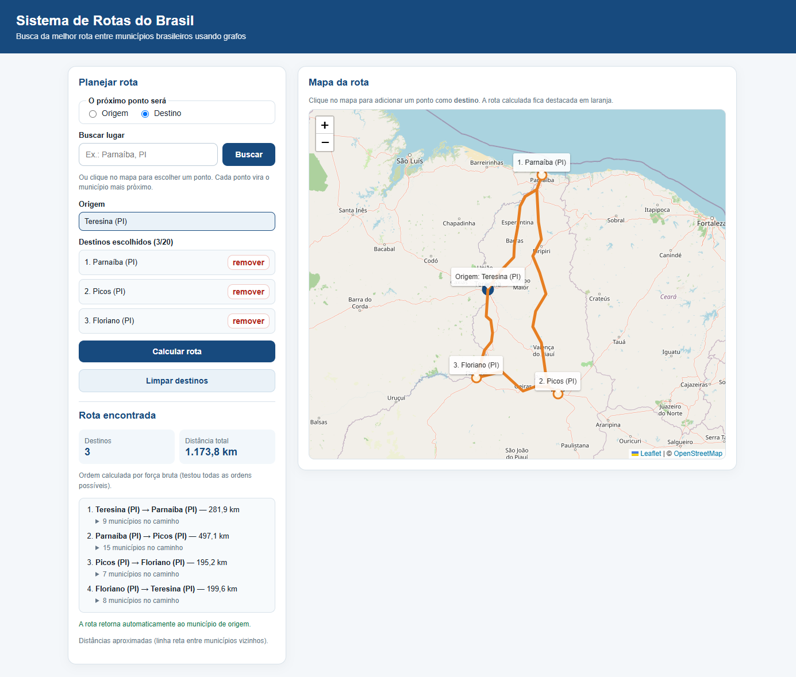

# Sistema de Rotas do Brasil

Calcula a **melhor rota** para visitar vários municípios brasileiros e voltar ao ponto de partida, usando **grafos**. Trabalho da disciplina **Estrutura de Dados II**.

- Escolha os pontos **digitando o nome** (sugestões de municípios enquanto digita; lugares que não são municípios via Nominatim/OpenStreetMap ao enviar) ou **clicando no mapa**.
- O backend (Python) encontra a **melhor ordem de visita** e o **menor caminho** entre cada par de cidades, num grafo com os **5.571 municípios** do Brasil.
- O front (React) desenha a rota no mapa.



> A versão original (15 municípios do Piauí, tudo no navegador) está em [`legado/grafo-de-municipios.html`](legado/grafo-de-municipios.html).

---

## Pré-requisitos

| Ferramenta | Versão mínima | Como verificar | Onde baixar |
|---|---|---|---|
| Node.js | 20.19 | `node --version` | https://nodejs.org/ (LTS) |
| Python | 3.11 | `python --version` (Windows: `py --version`) | https://www.python.org/downloads/ |
| Git | qualquer | `git --version` | https://git-scm.com/ |

**Windows:** no instalador do Python, marque **"Add python.exe to PATH"**. Depois de instalar qualquer coisa, abra um terminal novo.
**Linux (Debian/Ubuntu):** além do Python, instale o módulo venv: `sudo apt install python3-venv`.

Internet é necessária na primeira execução (instalar dependências), para a busca por lugares (Nominatim) e para os mapas.

---

## Preparando o ambiente e rodando

Tudo é feito por **um comando**, na pasta `estrutura-de-dados-2`:

```bash
npm run dev
```

Funciona igual em Windows (PowerShell ou cmd), Linux e macOS. Não é preciso ativar venv nem instalar nada antes além de Node e Python.

Quando aparecer `[web] ... Local: http://127.0.0.1:5173/`, abra esse endereço. Ctrl+C encerra o backend e o front juntos.

| Endereço | O quê |
|---|---|
| http://127.0.0.1:5173 | o sistema |
| http://127.0.0.1:8000/docs | documentação interativa da API |

Para só preparar o ambiente, sem subir os servidores: `npm run setup`.

### O que o `npm run dev` faz por você

1. Confere o **Node** (≥ 20.19).
2. Procura um **Python ≥ 3.11** testando, nesta ordem: variável `PYTHON`, `py -3` (Windows), `python3`, `python`. Cada um é executado de verdade, então o atalho falso da Microsoft Store é ignorado.
3. Cria (ou recria, se quebrada) a **venv** em `backend/.venv`. Ela nunca precisa ser ativada: o script chama o Python dela direto.
4. Roda `pip install -r backend/requirements.txt` **só se** o arquivo mudou desde a última vez.
5. Roda `npm install` em `frontend/` **só se** o `package-lock.json` mudou.
6. Gera o banco `backend/data/rotas.db` **só se** ele não existe (leva até cerca de 1 minuto).
7. Escolhe a porta da API (8000, ou a próxima livre) e avisa o front.
8. Sobe a API (`[api]`, ciano) e o front (`[web]`, magenta) no mesmo terminal.
9. No Ctrl+C (ou se um dos dois cair), encerra ambos, incluindo os processos filhos.

### Variáveis de ambiente opcionais

| Variável | Para quê |
|---|---|
| `PYTHON` | caminho do Python a usar, se ele não estiver no PATH |
| `API_PORT` | porta inicial da API (padrão 8000) |
| `NOMINATIM_EMAIL` | e-mail de contato enviado ao Nominatim (recomendado pela política de uso) |

Exemplo (PowerShell): `$env:API_PORT = "9000"; npm run dev` · (bash): `API_PORT=9000 npm run dev`

### Rodando cada parte separadamente

```bash
# só o backend (depois de um npm run setup)
cd backend
.venv/Scripts/python -m uvicorn app.main:app --reload --reload-dir app   # Windows
.venv/bin/python -m uvicorn app.main:app --reload --reload-dir app       # Linux/macOS

# só o front
cd frontend
npm run dev
npm run lint     # ESLint
```

Para **regerar o banco** (ex.: depois de mudar `construir_banco.py`), apague `backend/data/rotas.db` e rode `npm run dev`.

---

## Como funciona

### 1. Montagem do grafo (`backend/scripts/construir_banco.py`)

- **Vértices:** os 5.571 municípios (código IBGE, nome, UF, latitude, longitude).
- **Peso das arestas:** distância em km pela **fórmula de haversine** (linha reta sobre a esfera terrestre).
- **Arestas (k-NN):** cada município é ligado aos **6 vizinhos mais próximos**. É uma aproximação da malha de estradas: cidades vizinhas costumam ter ligação direta.
- **Conectividade (Kruskal + Union-Find):** o k-NN sozinho pode deixar "ilhas" de cidades sem ligação com o resto. Para evitar isso, calculamos uma **árvore geradora mínima** com o algoritmo de **Kruskal** sobre os 30 vizinhos mais próximos de cada município. O Kruskal usa **Union-Find** (união por rank + compressão de caminho) para saber se uma aresta une dois grupos diferentes. As arestas da árvore que faltavam entram no grafo (tipo `mst`), garantindo que **todo município alcança todos os outros**.
- Tudo é salvo em **SQLite** (`municipios` e `arestas`). Ao iniciar, a API carrega o grafo em memória como **lista de adjacência**.

### 2. Cálculo da rota (`POST /api/rotas`)

1. Para a origem e para cada destino, roda **Dijkstra** (fila de prioridade com `heapq`), obtendo a menor distância até todos os municípios.
2. Monta uma **matriz de distâncias** só entre os pontos escolhidos.
3. Escolhe a **ordem de visita** (problema do caixeiro-viajante, com volta à origem):
   - até **8 destinos**: **força bruta**, testando todas as ordens (8! = 40.320) — resultado ótimo garantido;
   - de **9 a 20 destinos**: **vizinho mais próximo** (vai sempre à cidade mais perto ainda não visitada) seguido de **2-opt** (inverte trechos da rota enquanto isso encurtar o total).
4. Reconstrói o caminho de cada trecho com o vetor de **anteriores** do Dijkstra.

### 3. Autocomplete de municípios (`GET /api/municipios`)

Enquanto se digita, o front pede sugestões ao nosso backend, que as tira de um **índice em memória** (`app/indice_nomes.py`): duas listas ordenadas, uma com o nome normalizado de cada município (sem acentos, minúsculas) e outra com cada palavra dos nomes. Os nomes que **começam** com o texto e os que têm uma **palavra** começando com ele são achados por **busca binária** (`bisect`), em **O(log n + k)**; só se faltar resultado há uma varredura linear por nomes que **contêm** o texto. Uma UF no fim ("santa luzia pi") filtra o resultado. O front espera **500 ms** depois da última tecla (debounce) e descarta respostas de digitações antigas. Não usamos o Nominatim para isso porque a política dele **proíbe autocomplete**; ele só é consultado ao enviar a busca (botão Buscar ou Enter sem sugestão destacada), para lugares que não são municípios.

### Complexidades

| Algoritmo | Complexidade | Onde |
|---|---|---|
| k-NN por força bruta | O(V²) — só na geração do banco | `construir_banco.py` |
| Kruskal + Union-Find | O(E log E) | `app/kruskal.py`, `app/union_find.py` |
| Dijkstra com heap | O((V + E) log V) por ponto | `app/dijkstra.py` |
| Força bruta da ordem | O(n!) | `app/melhor_rota.py` |
| Vizinho mais próximo | O(n²) | `app/melhor_rota.py` |
| 2-opt | O(n²) por passada | `app/melhor_rota.py` |
| Município mais próximo | O(V) | `app/geo.py` |
| Autocomplete (nome/palavra) | O(log n + k) por busca binária; O(n) só se faltar resultado | `app/indice_nomes.py` |

V = 5.571 municípios, E ≈ 20 mil arestas, n = nº de destinos.

### Limitação importante

As distâncias são **aproximadas**: somam linhas retas entre municípios vizinhos, não quilômetros reais de estrada. A rota mostra uma boa ordem de visita e por quais regiões passar, mas não substitui um GPS.

---

## Estrutura de pastas

```
estrutura-de-dados-2/
├── package.json            scripts "dev" e "setup" (sem dependências)
├── scripts/                orquestração em Node (setup.mjs, dev.mjs, lib/)
├── backend/
│   ├── requirements.txt
│   ├── data/               CSVs dos municípios (+ rotas.db gerado)
│   ├── scripts/construir_banco.py
│   └── app/                API FastAPI e algoritmos
│       ├── main.py         endpoints
│       ├── modelos.py      schemas de entrada/saída
│       ├── banco.py        SQLite
│       ├── grafo.py        Municipio e Grafo (lista de adjacência)
│       ├── indice_nomes.py índice ordenado + busca binária (autocomplete)
│       ├── geo.py          haversine, município mais próximo
│       ├── union_find.py   Union-Find
│       ├── kruskal.py      árvore geradora mínima
│       ├── dijkstra.py     menor caminho
│       ├── melhor_rota.py  ordem de visita (força bruta / heurística)
│       ├── planejamento.py junta tudo para um pedido de rota
│       └── nominatim.py    busca por nome (com limite de 1 req/s e cache)
├── frontend/               React + TypeScript + Vite + ESLint
│   └── src/
│       ├── api/cliente.ts
│       ├── hooks/usePlanejador.ts
│       └── components/     Cabecalho, PainelPlanejamento, BuscaLocal, SeletorModo,
│                           ListaPontos, ResultadoRota, MapaRota
├── legado/                 versão original em HTML
└── docs/                   especificação, plano e captura de tela
```

---

## API

### `GET /api/busca?q=Parnaíba`

```json
[
  {
    "rotulo": "Parnaíba, Piauí, Região Nordeste, Brasil",
    "lat": -2.9147, "lon": -41.7662,
    "municipio": { "id": 2207702, "nome": "Parnaíba", "uf": "PI", "lat": -2.90585, "lon": -41.7754 }
  }
]
```

### `GET /api/municipios?q=ter`

Sugestões de municípios (ignora acentos e maiúsculas; UF opcional no fim, como em `q=santa luzia ma`). Parâmetro opcional `limite` (1 a 20, padrão 8). Com menos de 2 caracteres responde `[]`.

```json
[
  { "id": 5008008, "nome": "Terenos", "uf": "MS", "lat": -20.4378, "lon": -54.8647 },
  { "id": 2211001, "nome": "Teresina", "uf": "PI", "lat": -5.09194, "lon": -42.8034 }
]
```

### `GET /api/municipios/proximo?lat=-5.09&lon=-42.80`

```json
{ "id": 2211001, "nome": "Teresina", "uf": "PI", "lat": -5.09194, "lon": -42.8034 }
```

### `POST /api/rotas`

Pedido:
```json
{ "origem_id": 2211001, "destinos_ids": [2207702, 2208007, 2203909] }
```

Resposta (resumida):
```json
{
  "distancia_total_km": 1173.8,
  "metodo": "forca_bruta",
  "ordem": [ { "nome": "Teresina", ... }, { "nome": "Parnaíba", ... }, ..., { "nome": "Teresina", ... } ],
  "trechos": [
    { "de": { ... }, "para": { ... }, "distancia_km": 281.9, "caminho": [ { ... }, { ... } ] }
  ]
}
```

Erros vêm como `{ "detail": "mensagem" }`:

| Status | Quando |
|---|---|
| 400 | sem destinos, mais de 20 destinos, origem repetida nos destinos, destinos repetidos, busca com menos de 2 letras |
| 404 | código de município inexistente |
| 422 | parâmetros inválidos (ex.: latitude fora de -90..90) |
| 502 | Nominatim fora do ar (a escolha pelo mapa continua funcionando) |

---

## Problemas comuns

| Mensagem / sintoma | Solução |
|---|---|
| `✖ Python 3.11+ não encontrado` | Instale o Python (veja Pré-requisitos) e abra um terminal novo. Se já está instalado fora do PATH, defina `PYTHON` com o caminho do executável. |
| `✖ Node 20.19+ é necessário` | Atualize o Node (LTS) em https://nodejs.org/. |
| `✖ Não foi possível criar o ambiente virtual` + dica de `python3-venv` | Linux: `sudo apt install python3-venv` e rode de novo. |
| `✖ A instalação das dependências do Python falhou` / `npm install do front falhou` | Verifique a internet. Em rede corporativa: `HTTPS_PROXY=http://servidor:porta` para o pip e `npm config set proxy http://servidor:porta` para o npm. |
| `• Porta 8000 ocupada; a API vai usar a 8001` | Não é erro; o front já é avisado da porta nova. |
| Busca mostra "Busca indisponível no momento" | O Nominatim está fora do ar ou limitou as requisições. Espere um pouco ou clique no mapa. |
| "Não foi possível falar com o servidor." na tela | A API não está rodando. Veja as linhas `[api]` no terminal. |
| Mapa cinza, sem imagens | Sem acesso a `tile.openstreetmap.org` (internet ou firewall). |
| Banco parece desatualizado | Apague `backend/data/rotas.db` e rode `npm run dev`. |

---

## Fontes e créditos

- Municípios: [kelvins/municipios-brasileiros](https://github.com/kelvins/municipios-brasileiros) (licença MIT), baseado em dados do IBGE.
- Mapas e busca: © [contribuidores do OpenStreetMap](https://www.openstreetmap.org/copyright) (ODbL). Busca via [Nominatim](https://nominatim.org/), respeitando a [política de uso](https://operations.osmfoundation.org/policies/nominatim/) (máx. 1 requisição/s, sem autocomplete, com cache). Tiles conforme a [política de tiles](https://operations.osmfoundation.org/policies/tiles/).
